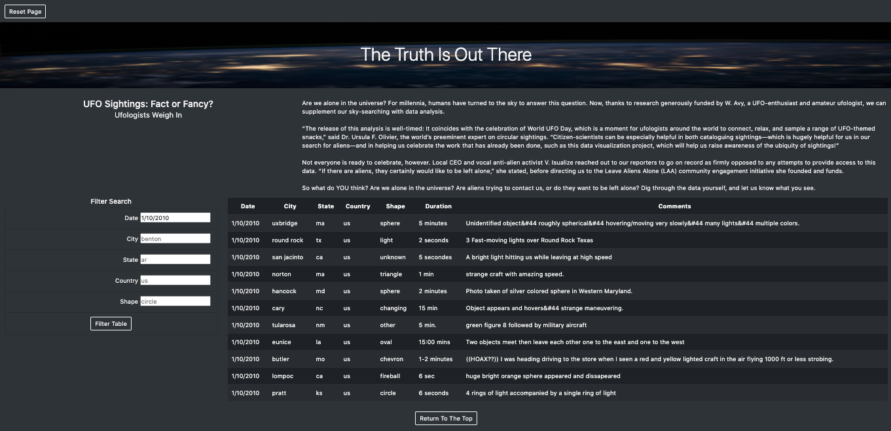

# UFO Sightings

## Project Overview
The purpose of the project was to create a dynamic webpage about UFO sightings using JavaScript and HTML. The webpage included a table where table contents could be filtered by date, city, state, country, and shape. Bootstrap and CSS were used to style the webpage. 

Additional bootstrap elements were included such as table formatting (including hover-over effect), button formatting (including the navigation bar), the addition of a "Return To The Top" button at the bottom of the web page, and text formatting. 

#### Web Page Screenshot

## Resources
- Software: JavaScript, HTML5, CSS3, and Bootstrap 4.0.0
- Data: <[data.js](static/js/data.js)> (UFO sightings data)

## Recommendation For Further Development
1) More UFO sightings data could be included, especially with regard to dates and countries. The file "data.js" only provides data for January 2010 and for the United States. 

2) Duration data could be "cleaned" in the file "data.js". Multiple formats were used to record duration of sightings. Standardizing the format would make the data easier to search so that a "duration" table filter could be created.

3) A styling suggestion is to create a drop-down menu for "Shape" in the "Filter Search" form since there are only a few shapes recorded and it is difficult for people to guess what shapes have been observed. Another is to discard the navigation bar and instead, add a "Reset" button (to reset the table) next to the "Filter Table" button.